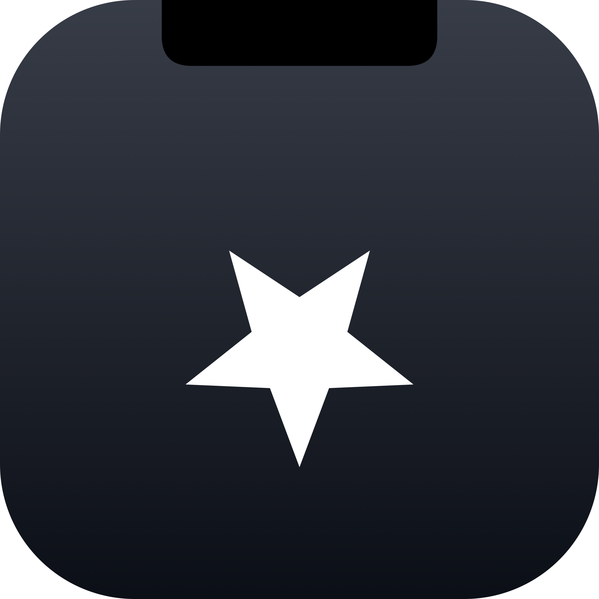
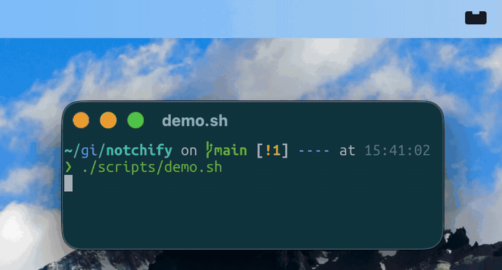

<h1 align="center">
  <br>
  
  <br>
  notchify
  <br>
</h1>

<h4 align="center">Banner-style notifications that drop out of the MacBook camera notch.</h4>

<p align="center">
  
</p>

## Use

```sh
notchify "Done" "build succeeded"    -sound ready
notchify "Heads up" "deploy needs input" -sound warning -symbol exclamationmark.triangle.fill -color orange
notchify "Open" "tap me"             -action https://example.com
notchify "Title only"                                  # body is optional
```

Positional args are `<title> [body]`, mirroring Linux's `notify-send`.
## Flags

| flag | examples / default |
|------|--------------------|
| `-icon <name\|path>` | SF Symbol name (`bell.fill`, `checkmark.circle`) or image file path (PNG/JPEG, animated GIF/WebP). Default: `bell.fill` |
| `-color <name>` | Tint for SF Symbol icons. `orange`/`red`/`yellow`/`green`/`blue`/`purple`/`pink`/`white`/`gray`. Ignored for image-file icons. Default: `white` |
| `-sound <name>` | `ready`/`warning`/`info`/`success`/`error`, or any name from `/System/Library/Sounds/` (e.g. `Glass`, `Ping`). Default: silent |
| `-action <url\|cmd>` | URL opened or shell command run on tap. Default: click only dismisses |
| `-focus` | Mutually exclusive with `-action`. Raises the source terminal app and (in tmux) jumps to the originating pane. Implies `-timeout 0` |
| `-timeout <secs>` | Auto-dismiss seconds. `0` = persistent (sits in chip until clicked). Default: `5` |
| `-group <name>` | Stack notifications under a named chip. Subsequent `-group <same>` calls collapse into one chip with a count badge. Chip's icon/color are taken from the first notification in that group |

`-focus` auto-detects the terminal app
(Ghostty, iTerm, Terminal, WezTerm, kitty, ...).
Set `NOTCHIFY_TERMINAL_BUNDLE` to override the detection
(e.g. `NOTCHIFY_TERMINAL_BUNDLE=com.github.wez.wezterm`).

## Motivation

Built for **ephemeral** notifications, the kind you might want from
multiple coding agents running in parallel, where dozens of entries
piling up in macOS Notification Center is the opposite of useful.
Notchify never touches Notification Center; once a notification
animates away it's gone, no history.

## Installation

Drag-install:

1. Grab the latest `Notchify.dmg` from Releases (or run `./scripts/package.sh`
   and use the produced `dist/Notchify.dmg`).
2. Open the DMG and drag `Notchify.app` to `/Applications`.
3. The bundle is only ad-hoc signed (no Apple Developer ID), so first
   launch from a downloaded DMG hits Gatekeeper. Two options:
   - Strip the quarantine attribute and launch normally:
     ```sh
     xattr -d com.apple.quarantine /Applications/Notchify.app
     open /Applications/Notchify.app
     ```
   - Or open System Settings → Privacy & Security, scroll to "Notchify
     was blocked", click **Open Anyway**, then confirm. (On macOS 15+,
     right-click → Open no longer bypasses this; the System Settings
     button is the only GUI path.)
4. Click the menubar icon → **Install CLI in /usr/local/bin** (creates the
   symlink with the standard macOS admin prompt). Skip if you only need
   the GUI.
5. Optional: same menu → **Launch at Login**.

Nix-darwin: see [Nix-darwin](#nix-darwin) below.

## Build

See [BUILDING.md](BUILDING.md).

## Behavior

- Click the rectangle: runs `-action` (if any) and retracts.
- Hover the body: pauses the auto-dismiss timer until the cursor moves away.
- Hover any chip on the shelf: drops down its full notification list.
  Click an individual row to dismiss it; click the chip itself to dismiss
  the topmost (newest) row.
- Multiple notifications queue and play in order. While the user is
  actively reading the pill (cursor anywhere on it), incoming arrivals
  are queued silently and resume playback once the cursor leaves.
- Up to 2 group chips render fully on the shelf; a 3rd group renders
  as a faded "+1" indicator on the leftmost edge until space frees up.
  Older groups beyond that are tracked in the data model but not shown.
- Inside a stack, up to ~3.5 rows are visible at once and the rest
  scroll, with a soft top/bottom fade indicating overflow.
- `-focus` notifications are auto-dismissed once the user visits the
  source: the daemon polls the frontmost app (and, when captured at
  fire time, the active tmux pane) once a second and removes any
  rows whose dismiss-key matches. Already on the source at fire
  time? The notification is dropped silently.
- Do-Not-Disturb active: ingested into its chip silently (no body,
  no sound) so the user can read it once DND clears.
- Renders only when macOS reports an active built-in notched display.
- Uses macOS screen geometry APIs to anchor the overlay to the
  built-in notch area, even with an external monitor attached.

## Nix-darwin

A flake is provided. Add the input and import the module:

```nix
{
  inputs.notchify.url = "github:sespiros/notchify";

  outputs = { self, nix-darwin, notchify, ... }: {
    darwinConfigurations."mybox" = nix-darwin.lib.darwinSystem {
      modules = [
        notchify.darwinModules.default
        { programs.notchify.enable = true; }
      ];
    };
  };
}
```

The build uses host Xcode.app for the macOS 13+ Swift toolchain, so
`darwin-rebuild` needs `--impure`:

```sh
darwin-rebuild switch --flake . --impure
```

This installs both the `notchify` CLI on PATH and `Notchify.app` to
`/Applications`.

## Agent integrations

Coding agents like Claude Code and Codex CLI expose event hooks.
Notchify ships ready-made integrations that wire those hooks to the
notch in one click. From the menubar icon, open **Integrations** and
pick the agent you want.

CLI equivalent:

```sh
notchify-recipes list
notchify-recipes install claude-code
notchify-recipes install codex
```

The menu also surfaces drift (a red dot) when an external tool such as
chezmoi has dropped the hook registrations from the agent's config —
click to re-sync.

Full reference, including how to author a new integration, lives in
[`recipes/README.md`](./recipes/README.md).

## Inspiration

- [cmux](https://github.com/manaflow-ai/cmux), multi-agent terminal manager.
- [herdr](https://github.com/ogulcancelik/herdr), agent-aware terminal
  multiplexer.
- [notchi](https://github.com/sk-ruban/notchi), notch-area utility on
  macOS.
